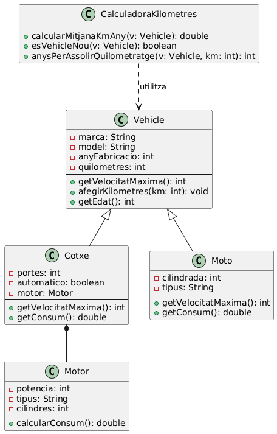

# 🚗 Projecte Exemple: Vehicles

Aquest projecte demostra:

- ✅ Implementació de classes Java amb **herència**, **composició** i altres relacions.
- ✅ Creació i execució de **tests unitaris** amb **JUnit 5**.
- ✅ Documentació amb **JavaDoc**.
- ✅ Creació de **diagrames UML de classes**.

---

## 1. 🧪 Funcions de Test

### Què són els tests unitaris?

Els tests unitaris són proves que validen el correcte funcionament de parts específiques del codi (normalment mètodes o funcions) de manera aïllada. Permeten detectar errors en fases primerenques.

---

### ✅ Com implementar tests unitaris amb JUnit

**1. Afegir les dependències al `pom.xml`:**

```xml
<dependency>
    <groupId>org.junit.jupiter</groupId>
    <artifactId>junit-jupiter-api</artifactId>
    <version>5.8.2</version>
    <scope>test</scope>
</dependency>
<dependency>
    <groupId>org.junit.jupiter</groupId>
    <artifactId>junit-jupiter-engine</artifactId>
    <version>5.8.2</version>
    <scope>test</scope>
</dependency>

Crear una classe de test dins del directori src/test/java:

El nom de la classe ha de tenir el sufix "Test" (per convenció)

Cada mètode que volem testejar ha de tenir un mètode de test corresponent, amb l'anotació @Test


Utilitzar assertions per verificar els resultats esperats:

- assertEquals(expected, actual): Verifica si dos valors són iguals

- assertTrue(condition): Verifica si una condició és certa

- assertFalse(condition): Verifica si una condició és falsa

- assertThrows(expectedType, executable): Verifica si es llança una excepció del tipus esperat


Anotacions útils:

<u>@BeforeEach:</u> S'executa abans de cada test

<u>@AfterEach:</u> S'executa després de cada test

<u>@DisplayName:</u> Proporciona un nom descriptiu al test


Exemple de test unitari

En aquest projecte hem creat la classe CalculadoraKilometresTest que prova la classe CalculadoraKilometres:

java@Test

@DisplayName("Test calculadora mitjana km/any")

public void testCalcularMitjanaKmAny() {

// Comprovem que la mitjana del vehicle nou és 2500 km/any

assertEquals(2500.0, CalculadoraKilometres.calcularMitjanaKmAny(vehicleNou), 0.1);

// Comprovem que la mitjana del vehicle usat poc és 6000 km/any

assertEquals(6000.0, CalculadoraKilometres.calcularMitjanaKmAny(vehicleUsatPoc), 0.1);

// Comprovem que la mitjana del vehicle usat molt és 25000 km/any

assertEquals(25000.0, CalculadoraKilometres.calcularMitjanaKmAny(vehicleUsatMolt), 0.1);

}

Com executar els tests

Els tests es poden executar de diverses maneres:

Amb Maven:

Obrir un terminal a la carpeta arrel del projecte

Executar la comanda: mvn test

Per executar un test específic: mvn exec:java

Interpretació dels resultats:

Tests en verd: tots els tests han passat correctament

Tests en vermell: algun test ha fallat, amb detalls de l'error

La consola mostra un resum amb el nombre de tests executats, fallats i ignorats


1. Documentació JavaDoc

Què és JavaDoc?

JavaDoc és una eina inclosa al JDK que genera documentació en format HTML a partir dels comentaris del codi font Java. Permet documentar classes, mètodes, atributs i altres elements de manera estandarditzada.

Elements de la documentació JavaDoc

Els comentaris JavaDoc es delimiten amb /\*\* a l'inici i \*/ al final, i poden incloure:

Text descriptiu: Explica el propòsit de la classe o mètode.

Tags que comencen amb @:

@param nom\_paràmetre descripció: Descriu un paràmetre d'un mètode

@return descripció: Descriu el valor de retorn

@throws classe\_excepció descripció: Documenta excepcions que pot llançar el mètode

@author nom: Indica l'autor del codi

@version número: Indica la versió

@see referència: Afegeix referències a altres elements

@deprecated raó: Indica que l'element està obsolet i no hauria d'utilitzar-se


Exemple de comentari JavaDoc

java/\*\*

* Calcula la mitjana de quilòmetres per any del vehicle.

\*

* @param vehicle El vehicle a calcular
* @return La mitjana de quilòmetres per any
* @throws IllegalArgumentException Si el vehicle és null o l'edat és 0

\*/

public static double calcularMitjanaKmAny(Vehicle vehicle) {

// Implementació...

}

Com generar documentació JavaDoc en HTML

Per generar la documentació en format HTML:

Amb Maven:

Executar la comanda: mvn javadoc:javadoc

La documentació es generarà al directori configurat (per defecte, target/site/apidocs/)

En el nostre projecte, hem configurat que es generi a docs/javadoc/


Des de l'IDE:

Molts IDEs tenen opcions integrades per generar JavaDoc

En IntelliJ IDEA: Tools > Generate JavaDoc

En Eclipse: Project > Generate Javadoc


Des de la línia de comandes:

Utilitzar la comanda javadoc:

javadoc -d docs/javadoc -sourcepath src/main/java -subpackages com.exemple


Recomanacions per a una bona documentació

Escriure comentaris clars i concisos

Documentar tots els paràmetres, valors de retorn i excepcions

Explicar el "perquè" més que el "què" (el codi ja mostra el que fa)

Mantenir la documentació actualitzada quan el codi canvia

Utilitzar exemples quan sigui útil

3\. Diagrames de Classes UML

Què són els diagrames de classes?

Els diagrames de classes UML (Unified Modeling Language) són representacions gràfiques de l'estructura estàtica d'un sistema. Mostren les classes, els seus atributs, mètodes i les relacions entre elles.

Elements principals dels diagrames de classes

Classes: Representades per rectangles dividits en tres seccions:

Nom de la classe

Atributs

Mètodes


Visibilitat:

+: públic

-: privat

#: protegit

~: paquet (default)


Relacions entre classes:

Herència: Una classe hereta d'una altra (fletxa amb triangle buit)

Associació: Una classe està relacionada amb una altra (línia simple)

Agregació: Una classe conté referències a una altra, però no depèn d'ella (línia amb diamant buit)

Composició: Una classe conté i és responsable d'una altra (línia amb diamant ple)

Dependència: Una classe utilitza una altra temporalment (línia discontínua amb fletxa)


Diagrama de classes del nostre projecte



Descripció de les relacions en el nostre projecte

Herència:

Cotxe i Moto hereten de Vehicle. Això significa que comparteixen els atributs i mètodes de la classe pare, i poden afegir-ne de propis o sobreescriure els existents.


Composició:

Cotxe té una relació de composició amb Motor. Això significa que un Cotxe conté un Motor i és responsable del seu cicle de vida. Si el Cotxe es destrueix, el Motor també.


Dependència:

CalculadoraKilometres depèn de Vehicle. Això significa que utilitza temporalment objectes de tipus Vehicle als seus mètodes, però no els emmagatzema.


Exemple de diferents tipus de relacions

Herència

javapublic class Vehicle {

// Atributs i mètodes

}

public class Cotxe extends Vehicle {

// Atributs i mètodes addicionals

}

Composició

javapublic class Cotxe {

private Motor motor; // El motor forma part integral del cotxe

public Cotxe(Motor motor) {

this.motor = motor;

}

}

Agregació

javapublic class Garatge {

private List<Vehicle> vehicles; // Els vehicles poden existir fora del garatge

public void afegirVehicle(Vehicle v) {

vehicles.add(v);

}

}

Dependència

javapublic class CalculadoraKilometres {

public static double calcularMitjanaKmAny(Vehicle vehicle) {

// Utilitza temporalment el vehicle

}

}

Execució del projecte

Requisits

Java 11 o superior

Maven 3.6 o superior

Passos per executar el projecte

Clonar o descarregar el projecte

Compilar el projecte:

mvn compile

Executar els tests:

mvn test

Generar la documentació JavaDoc:

mvn javadoc:javadoc

La documentació es generarà a docs/javadoc/.

Generar un JAR executable:

mvn package

El fitxer JAR es generarà a target/projecte-exemple-1.0-SNAPSHOT.jar.
