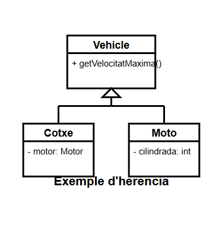
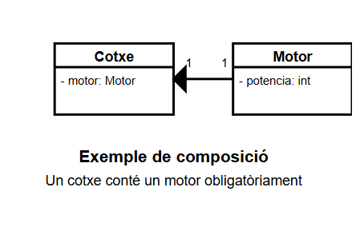
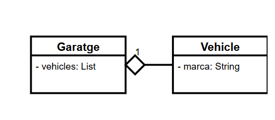
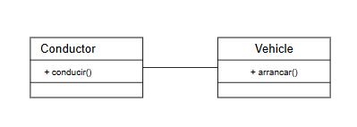
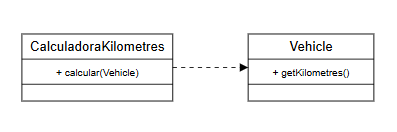
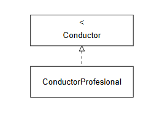
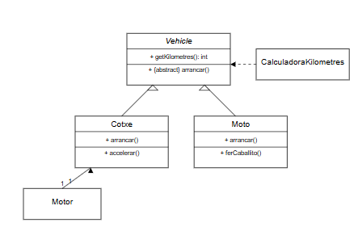

# Diagrames de Classes UML

## Què són els diagrames de classes?

Els **diagrames de classes UML** (Unified Modeling Language) són representacions gràfiques que mostren l'estructura estàtica d'un sistema orientat a objectes. Aquests diagrames mostren les **classes del sistema**, els seus **atributs**, **mètodes** i les **relacions** entre classes.

## Elements principals dels diagrames de classes

### **Classes**

Una classe es representa per un rectangle dividit en tres seccions:

- **Nom de la classe**: Part superior, normalment en **negreta**.
- **Atributs**: Part mitjana, amb tipus i visibilitat.
- **Mètodes**: Part inferior, amb paràmetres, tipus de retorn i visibilitat.

### **Visibilitat**

Es mostra amb símbols davant de cada atribut o mètode:

- **+**: Públic
- **-**: Privat
- **#**: Protegit
- **~**: Paquet (per defecte)

## Tipus de relacions

### 1. **Herència (Generalització/Especialització)**

L'**herència** és una relació "és un tipus de" on una classe (subclasse) hereta atributs i mètodes d'una altra classe (superclasse).

**Representació**: Una línia amb un triangle buit apuntant a la superclasse.

**Exemple**:

En el nostre projecte, tant **Cotxe** com **Moto** hereten de **Vehicle**.

### 2. **Composició**

La **composició** és una relació "conté" forta, on el component no pot existir sense el compost. Si el compost es destrueix, també es destrueixen els seus components.

**Representació**: Una línia amb un diamant ple al costat del compost.

**Exemple**:

En el nostre projecte, un **Cotxe** conté un **Motor** i en controla el cicle de vida.

### 3. **Agregació**

L'**agregació** és una relació "conté" més feble, on el component pot existir independentment del compost.

**Representació**: Una línia amb un diamant buit al costat del compost.

**Exemple**:

Un **Garatge** pot contenir diversos **Vehicles**, però aquests poden existir fora del garatge.

### 4. **Associació**

L'**associació** representa una relació general entre dues classes, indicant que una classe utilitza o interactua amb una altra.

**Representació**: Una línia simple entre classes.

**Exemple**:

Un **Conductor** pot utilitzar un **Vehicle**, però les dues entitats són independents.

### 5. **Dependència**

La **dependència** indica que una classe utilitza una altra temporalment, com a paràmetre de mètode, variable local, etc.

**Representació**: Una línia discontínua amb una fletxa apuntant a la classe de la qual depèn.

**Exemple**:

En el nostre projecte, **CalculadoraKilometres** utilitza objectes **Vehicle** als seus mètodes, però no els emmagatzema.

### 6. **Implementació (Realització)**

La **implementació** indica que una classe implementa els mètodes definits en una interfície.

**Representació**: Una línia discontínua amb un triangle buit apuntant a la interfície.

**Exemple**:

## Multiplicitat en les relacions

La **multiplicitat** indica quants objectes d'una classe poden relacionar-se amb un objecte d'una altra classe:

- **1**: Exactament un
- **\***: Zero o més (equivalent a 0..*)
- **0..1**: Zero o un
- **1..***: Un o més
- **5..10**: Entre 5 i 10

**Exemple**:

## Diagrama de classes complet del nostre projecte

El nostre projecte conté les següents classes i relacions:

- **Vehicle** (classe abstracta)
- **Cotxe** (hereta de Vehicle)
- **Moto** (hereta de Vehicle)
- **Motor** (en composició amb Cotxe)
- **CalculadoraKilometres** (depèn de Vehicle)

## Casos específics en diagrames de classes

### **Classes abstractes**

Les **classes abstractes** es mostren amb el nom en **cursiva** o amb l'estereotip `<<abstract>>`.

### **Interfícies**

Les **interfícies** es mostren amb l'estereotip `<<interface>>` o com a cercles (notació alternativa).

### **Classes estàtiques**

Les **classes estàtiques** o utilitàries (amb mètodes estàtics) poden mostrar-se amb l'estereotip `<<utility>>`.

### **Enumeracions**

Les **enumeracions** es mostren amb l'estereotip `<<enumeration>>` i llisten els valors possibles.

## Eines per crear diagrames de classes

Hi ha diverses eines per crear diagrames UML:

- **Draw.io / diagrams.net**: Eina online gratuïta.
- **Visual Paradigm**: Eina professional amb versió comunitat.
- **Lucidchart**: Eina online amb versió gratuïta limitada.
- **StarUML**: Aplicació d'escriptori gratuïta.
- **PlantUML**: Eina basada en text que genera diagrames.

## Bones pràctiques en diagrames de classes

- **Simplicitat**: Mostrar només les classes i relacions necessàries per entendre el sistema.
- **Claredat**: Evitar creuaments de línies.
- **Consistència**: Mantenir un estil coherent en tot el diagrama.
- **Llegibilitat**: Utilitzar etiquetes i notes quan sigui necessari.
- **Agrupació**: Agrupar classes relacionades en paquets.
